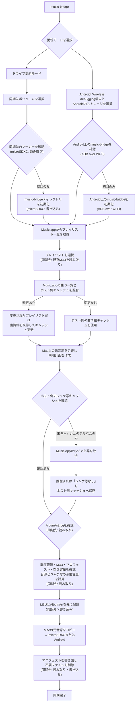

# Music Bridge

**MacのMusic.appで作ったプレイリストを、Androidでそのまま再生できる形にするCLIツールです。**

Music.appのローカル音源と選択したプレイリストから、Android向けの音源ファイル・相対パスM3Uプレイリスト・アルバムアートをひとつのディレクトリへ生成します。Macへ接続したmicroSDXCのほか、Wireless debuggingで接続したAndroidへ直接同期できます。

```text
Music.appのプレイリスト
        ↓
Music Bridge
        ↓
Androidで再生できる音源 + M3U + AlbumArt
```

> **注意**
>
> 同期先の `music-bridge` ディレクトリはツールが管理するため、既存データがあるストレージでは最初に `--dry-run` を使ってください。

## できること

- **Music.appのプレイリストをAndroid向けM3Uへ変換**
  - 実際にコピーした音源を参照する相対パスのプレイリストを生成します。
- **プレイリストを起点に、必要なローカル音源だけを同期**
  - 複数プレイリストで同じ曲を使っても、音源ファイルは重複しません。
- **Android用の自己完結した音楽ライブラリを作成**
  - 音源・プレイリスト・アルバムアートを `music-bridge` ディレクトリだけにまとめます。
- **選択内容に合わせて同期先を整理**
  - 選択から外したプレイリストと、参照されなくなった管理対象の音源を取り除きます。
- **AndroidへWi-Fiで直接同期**
  - 内部ストレージ、SDカード、USB OTGストレージから同期先を選択できます。
  - Wi-Fiが切れても再接続を待ち、転送済みの位置から再開します。

## 要件

- macOS
- Music.app（同期したい曲がローカルに保存されていること）
- Go 1.22以降
- ドライブ更新モードを使う場合は、microSDXCなどMacへマウントできる同期先
- Android直接同期を使う場合はADB（Android Debug Bridge）

初回実行時には、ターミナルからMusic.appを操作するためのAutomation許可をmacOSが求めます。許可してください。

## 使い方

リポジトリ直下がGoモジュールのルートです。

```bash
# 同期先とプレイリストを選んで同期
go run ./cmd/music-bridge
```

初めて使うストレージでは、専用ディレクトリを初期化します。

```bash
go run ./cmd/music-bridge --init-target
```

実際にはコピー・削除せず、同期内容を確認するには `--dry-run` を使います。

```bash
go run ./cmd/music-bridge --dry-run
```

### AndroidへWi-Fiで直接同期

MacへADBを導入します。

```bash
brew install android-platform-tools
```

Androidの開発者向けオプションでWireless debuggingを有効にし、画面に表示されるアドレスとコードを使って初回だけペアリング・接続します。

```bash
adb pair IP_ADDRESS:PAIRING_PORT
adb connect IP_ADDRESS:DEBUG_PORT
```

接続後は`music-bridge`を実行し、最初の画面で「Android更新モード」を選択します。接続済み端末が複数ある場合は端末を選択し、続いて内部ストレージ・SDカード・USB OTGストレージから同期先を選択します。Android端末をMacへUSB接続して同期する機能ではありません。

Macへ直接接続して同期済みのmicroSDXCをAndroidへ戻した後も、同じ音源を再転送せずにAndroid直接同期へ切り替えられます。macOSとAndroidで見え方が異なるFAT/exFATの予約文字や大文字・小文字はMusic Bridgeが同一パスとして扱います。

```bash
music-bridge
```

転送中に画面が消えたりWi-Fi接続が切れたりした場合は、自動で再接続を続けます。1分経っても戻らなければ通知音を鳴らし、その後も5分ごとに通知しながら再接続を継続します。中止する場合は `Ctrl+C` を押してください。端末の再起動などでADBの接続先IDが変わっても、同じ端末を再検出します。接続が戻るとAndroid上の部分ファイルを確認し、未転送位置から再開します。

初回の同期では選択したプレイリストの曲情報をMusic.appから取得し、Macのキャッシュへ保存します。以後は、Music.appから曲ID一覧だけを読み取ってキャッシュと照合し、曲の追加・削除・入れ替え・並び順が変わったプレイリストだけ詳細情報を再取得します。詳細情報はプレイリストごとにキャッシュへ保存するため、途中で同期が中断しても、取得済みプレイリストのキャッシュは次回利用できます。

ジャケ写もアルバム単位でMacへキャッシュします。ジャケ写がないアルバムも確認済みとして記録するため、Androidとの接続断や転送失敗後に同じジャケ写をMusic.appから取得し直しません。キャッシュは同期先ごとに分かれず、Macへ接続したドライブとAndroid直接同期の両方で共用します。

曲名・アーティスト名・アルバム名などのタグ変更を反映したい場合は、`--refresh` で選択したプレイリストの詳細情報をすべて更新してください。

```bash
go run ./cmd/music-bridge --refresh
```

配布用の自己完結したディレクトリを作る場合:

```bash
make build
```

`dist/music-bridge/`にバイナリと必要な`scripts/`が作られます。このディレクトリごと任意の場所へ移動できます。

どのディレクトリからでも`music-bridge`を実行できるようにインストールする場合:

```bash
make
music-bridge
```

`make install`も同じく、ビルドしてからインストールします。

`~/.local/bin`がPATHに含まれていない場合は、シェル設定へ追加してください。

## 処理の流れ

`microSDXC` と書かれた処理が、同期先ストレージへのアクセスです。Music.appの情報取得や、Mac内の元音源の走査はmicroSDXCへアクセスしません。



## Android側の設定

Androidの音楽再生アプリには、ボリューム全体ではなく同期先の `music-bridge` ディレクトリを音楽フォルダとして指定してください。

```text
music-bridge/
├── Library/
│   └── Artist/
│       └── Album/
│           ├── 01 Track.m4a
│           └── AlbumArt.jpg
└── Playlist Name.m3u
```

生成されるM3Uは、`Library/Artist/Album/Track.m4a` のようにこのディレクトリ内の音源を相対パスで参照します。そのため、Androidへコピーしたあともプレイリストから曲を再生できます。

## 開発構成

Goコードは、CLIの入口・ユースケース調停・転送方式・共有ドメインを分けています。

```text
cmd/music-bridge/        CLIエントリーポイント
internal/app/            引数解析、モード選択、終了処理
internal/drive/          Macにマウントしたドライブへの同期
internal/android/        ADB経由のAndroid同期
internal/musicapp/       Music.app連携、曲情報・ジャケ写キャッシュ
internal/library/        曲・プレイリスト・転送計画のドメインモデル
internal/layout/         両同期方式で共有する保存形式
internal/playlistfile/   Android向けM3U生成
internal/playlistselect/ プレイリスト選択
internal/portable/       FAT/exFAT・Android間のパス正規化
internal/targetlock/     同一同期先への多重起動防止
internal/tui/            ターミナルUI
```

ドライブ同期とAndroid同期は `internal/layout`、`internal/library`、`internal/playlistfile`、`internal/portable` の規則を共用します。このため、カードリーダー経由で初回同期したmicroSDXCをAndroidへ戻し、その後ADB経由の差分同期へ切り替えられます。

### テスト

```bash
make test
```

macOSでMusic.appと`osascript`を利用できる場合は、実際にMusic.appへ問い合わせてプレイリスト一覧を取得する統合テストも実行します。

ADBとAndroid EmulatorのAVDを利用できる場合、`make test`はAVDをヘッドレス起動し、終了時に停止します。仮想SDへの転送、M3U・manifest生成、部分ファイルからの再開、再同期時の差分ゼロを検証します。Android SDKやAVDがない環境では、エミュレーター統合テストだけをスキップします。

`go test ./...`を直接実行した場合も、起動済みのAndroid Emulatorがあれば同じ統合テストを実行します。

ADBサーバーを停止する接続断E2Eは、物理Android端末を同時に切断しないよう、ADBにエミュレーターしか接続されていない隔離環境で実行します。

## 同期の扱い

- 既に同じ音源があれば再転送しません。
- 新規の音源・ジャケ写・プレイリストを合算して必要容量を確認します。
- 選択済みのM3Uと `AlbumArt.jpg` は、音源転送より先に配置します。
- 選択しなかったプレイリストのM3Uは削除します。
- どの選択済みプレイリストからも参照されない、Music Bridge管理下の音源は削除します。
- 容量不足時は警告を表示し、空き容量に収まる範囲で同期します。
- Android直接同期では、端末・ストレージの組み合わせごとに同時実行を防ぎます。別ストレージへの同期は同時に実行できます。
- Android直接同期の部分ファイルには転送元のサイズと更新日時を記録し、異なる内容の部分ファイルを誤って再利用しません。

`music-bridge` ディレクトリはMusic Bridge専用として扱ってください。手動でファイルを置く用途には向きません。

## 注意事項・既知の制限

- 同名のプレイリストには対応していません。検出時は警告を表示します。
- Music.app上でローカルファイルの場所を取得できない曲は同期できません。
- 大規模ライブラリでは、Music.appからの曲情報・ジャケ写取得に時間がかかる場合があります。
- コンテンツの転送が始まるまではMusic.appを終了しないでください。音源・ジャケ写・プレイリストの転送進捗が表示された後は、Music.appを終了しても同期に影響しません。
- Android直接同期を始める前に、MacとAndroidが同じネットワーク上でADB接続済みであることを確認してください。

## License

[MIT License](LICENSE)
