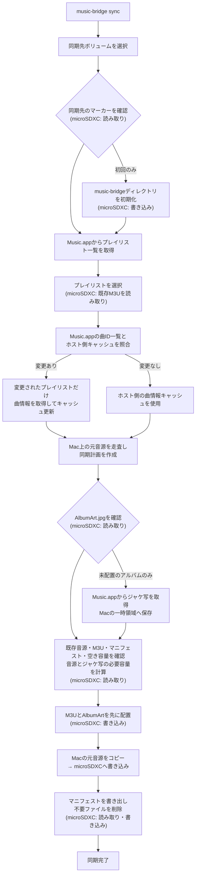

# Music Bridge

**MacのMusic.appで作ったプレイリストを、Androidでそのまま再生できる形にするCLIツールです。**

Music.appのローカル音源と選択したプレイリストから、Android向けの音源ファイル・相対パスM3Uプレイリスト・アルバムアートをひとつのディレクトリへ生成します。microSDXCを主な同期先として想定しています。

```text
Music.appのプレイリスト
        ↓
Music Bridge
        ↓
Androidで再生できる音源 + M3U + AlbumArt
```

> **開発中（α版）**
>
> 個人利用で検証中です。同期先の `music-bridge` ディレクトリはツールが管理するため、既存データがあるストレージでは最初に `--dry-run` を使ってください。

## できること

- **Music.appのプレイリストをAndroid向けM3Uへ変換**
  - 実際にコピーした音源を参照する相対パスのプレイリストを生成します。
- **プレイリストを起点に、必要なローカル音源だけを同期**
  - 複数プレイリストで同じ曲を使っても、音源ファイルは重複しません。
- **Android用の自己完結した音楽ライブラリを作成**
  - 音源・プレイリスト・アルバムアートを `music-bridge` ディレクトリだけにまとめます。
- **選択内容に合わせて同期先を整理**
  - 選択から外したプレイリストと、参照されなくなった管理対象の音源を取り除きます。

## 要件

- macOS
- Music.app（同期したい曲がローカルに保存されていること）
- Go 1.22以降
- Android端末またはmicroSDXCをMacへマウントできること

初回実行時には、ターミナルからMusic.appを操作するためのAutomation許可をmacOSが求めます。許可してください。

## 使い方

リポジトリ直下がGoモジュールのルートです。

```bash
# Music.appで認識しているプレイリストを確認
go run ./cmd/music-bridge playlists

# 同期先とプレイリストを選んで同期
go run ./cmd/music-bridge sync
```

初めて使うストレージでは、専用ディレクトリを初期化します。

```bash
go run ./cmd/music-bridge sync --target /Volumes/MUSIC_SD --init-target
```

実際にはコピー・削除せず、同期内容を確認するには `--dry-run` を使います。

```bash
go run ./cmd/music-bridge sync --target /Volumes/MUSIC_SD --dry-run
```

初回の同期では選択したプレイリストの曲情報をMusic.appから取得し、Macのキャッシュへ保存します。以後は、Music.appから曲ID一覧だけを読み取ってキャッシュと照合し、曲の追加・削除・入れ替え・並び順が変わったプレイリストだけ詳細情報を再取得します。詳細情報はプレイリストごとにキャッシュへ保存するため、途中で同期が中断しても、取得済みプレイリストのキャッシュは次回利用できます。

曲名・アーティスト名・アルバム名などのタグ変更を反映したい場合は、`--refresh` で選択したプレイリストの詳細情報をすべて更新してください。

```bash
go run ./cmd/music-bridge sync --refresh
```

配布用の自己完結したディレクトリを作る場合:

```bash
make build
```

`dist/music-bridge/`にバイナリと必要な`scripts/`が作られます。このディレクトリごと任意の場所へ移動できます。

どのディレクトリからでも`music-bridge`を実行できるようにインストールする場合:

```bash
make
music-bridge sync
```

`make install`も同じく、ビルドしてからインストールします。

`~/.local/bin`がPATHに含まれていない場合は、シェル設定へ追加してください。

## 処理の流れ

`microSDXC` と書かれた処理が、同期先ストレージへのアクセスです。Music.appの情報取得や、Mac内の元音源の走査はmicroSDXCへアクセスしません。



## Android側の設定

Androidの音楽再生アプリには、ボリューム全体ではなく同期先の `music-bridge` ディレクトリを音楽フォルダとして指定してください。

```text
music-bridge/
├── Library/
│   └── Artist/
│       └── Album/
│           ├── 01 Track.m4a
│           └── AlbumArt.jpg
└── Playlist Name.m3u
```

生成されるM3Uは、`Library/Artist/Album/Track.m4a` のようにこのディレクトリ内の音源を相対パスで参照します。そのため、Androidへコピーしたあともプレイリストから曲を再生できます。

## 同期の扱い

- 既に同じ音源があれば再転送しません。
- 新規の音源とジャケ写を合算して必要容量を確認します。
- 選択済みのM3Uと `AlbumArt.jpg` は、音源転送より先に配置します。
- 選択しなかったプレイリストのM3Uは削除します。
- どの選択済みプレイリストからも参照されない、Music Bridge管理下の音源は削除します。
- 容量不足時は警告を表示し、空き容量に収まる範囲で同期します。

`music-bridge` ディレクトリはMusic Bridge専用として扱ってください。手動でファイルを置く用途には向きません。

## 注意事項・既知の制限

- 同名のプレイリストには対応していません。検出時は警告を表示します。
- Music.app上でローカルファイルの場所を取得できない曲は同期できません。
- 大規模ライブラリでは、Music.appからの曲情報・ジャケ写取得に時間がかかる場合があります。
- コンテンツの転送が始まるまではMusic.appを終了しないでください。`コピー中` と表示された後はMusic.appを終了しても同期に影響しません。

## License

[MIT License](LICENSE)
